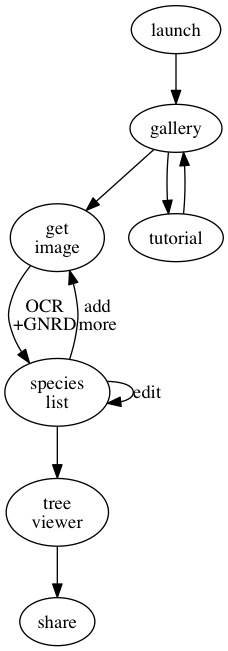
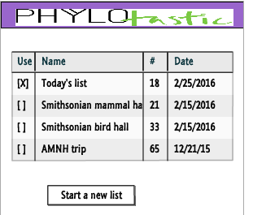

# Mobile app workflows 

## Quick overview of interface elements and processes 

### Live mockup

This will make a lot more sense if you check out the [live mock-up](http://lumzy.com/access/?id=9F68634BA781D0C704832865D01C6BEC) first. 

### A note about the gallery
My vision for the gallery is that every registered user of phylotastic apps has a personal gallery that we maintain on a networked server, consisting of records with UIDs that include the actual tree structure, the provenance, and a view.  The web toolbox, the mobile app, and other apps will access the gallery.  When the user launches an app for the first time, they will be asked to log in or register for an account.  The app's gallery will then be populated with the user's online gallery (or it will be empty for unregistered users).  So, for instance, if a user had 20 trees in her gallery from using the web toolbox, these would be visible the first time she logs in.  

### Views
The basic functionality can be implemented with just 5 main views.  Note that without the list-master, the app can only have one list (either start a new one each time it is launched, or always add to the same list).  
* master (background) - there is a strip of buttons at the bottom, and a logo at the top
* Gallery - the home view, starts out empty
* Source Picker - pop-up to choose "Take Photo", "Photo Library" or "Cancel"
* Image view - view of image with option to proceed to name-extraction or cancel
* List view - list of extracted names (select for taxon view), "Get tree" button
* Tree view - graphic display of extracted tree, option to share 

The following views extend the functionality considerably
* List master - needed to manage multiple lists
* Share view - options for sharing to phylotastic gallery, twitter, facebook, etc. 
* Taxon view - mash-up of information on a species selected from List view

In particular, the taxon view turns the app into a museum guide even if the phylogeny feature is not used.  

## Use case - Field trip

Assume middle-school or higher level.  The students are brought into an area with a variety of species represented in displays with signage.  This might be an entire zoo, the mammal room at the museum, or even just a collection of herbarium sheets.  

### Workflow 1

Students are assigned to collect 12 species to make a tree.  The aim is to get as much phylogenetic diversity as possible.  Trees are tweeted to the instructor at the end of the session.  

* Launch: user launches app 
   * --> show home gallery (empty for first-time user)
* HowTo: user selects "show me how"
   * --> tutorial launches (brief video on how to use app)
   * --> return to home gallery
* NameCapture: user selects "get image"
   * --> source picker 
   * user chooses "Take Photo"
      * --> go to device camera
      * user takes photo
         * --> go to image view 
         * user selects "extract names"
            * --> show spinner during name extraction 
            * --> when complete, go to list view 
* user repeats NameCapture to add 11 more species names
* TreeCapture: user selects "get tree" from list view 
   * --> show tree view 
* TreeShare: from tree view, user selects "share" 
   * --> show share view
   * user selects twitter, adds comment, clicks post
      * --> tree is synced with personal phylotastic gallery 
      * --> tree is posted to twitter with comment

         
### Variations on Workflow 1

#### Using a photo library 

One student, prior to launching the app, takes 12 images, which are now available in the device's photo library. 

* NameCapture: user selects "get image"
   * --> source picker 
   * user chooses "Photo Library"
      * --> go to device photo library
      * user chooses photo
         * --> (all subsequent steps are the same)
         
#### Canceling extraction

* NameCapture: user selects "get image"
   * --> source picker 
   * user chooses "Take Photo"
      * --> go to device camera
      * user takes photo
         * --> go to image view 
         * user doesn't like photo, chooses "cancel" 
            * --> return to List view

## Use case - managing multiple lists

User is managing two lists.  One of them is only for birds, the other for mammals.    This is what the list-master might look like for this user: 

* user launches app
* user selects the list-master icon in the bottom nav strip
   * --> show List-master view 
   * user selects the "Smithsonian bird hall" list
   * user proceeds with name capture for bird names using the bottom nav strip.  
      * --> [NameCapture and TreeCapture are the same as before]
* user selects the list-master icon in the bottom nav strip
   * --> show List-master view 
   * user selects the "Smithsonian mammal hall" list
   * user proceeds with name capture for mammal names using the bottom nav strip.  
      * --> [NameCapture and TreeCapture are the same as before]

